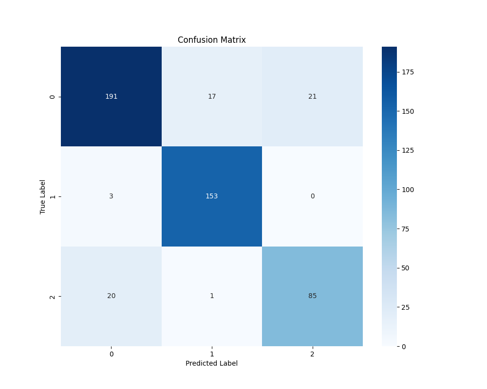

# 🧠 Deep Learning-Driven MRI Analysis for Brain Tumor Detection, Segmentation & Classification  

This project implements a **two-stage AI pipeline** for brain tumor analysis using the **BraTS dataset (University of Pennsylvania)**.  
It combines **segmentation (U-Net)** and **classification (DenseNet-121)**, optimized for clinical interpretability and reproducibility.  

---

## 📊 Capstone Poster


---

## 🔬 Pipeline Architecture


**Stage 1 — Segmentation (3D U-Net):**
- Inputs: multi-modal MRI scans (T1, T1ce, T2, FLAIR)  
- Outputs: WT (Whole Tumor), TC (Tumor Core), ET (Enhancing Tumor) masks  
- Loss: Dice + Cross-Entropy  

**Stage 2 — Classification (DenseNet-121):**
- Inputs: segmented tumor region  
- Outputs: Tumor Type → Glioma, Meningioma, or Pituitary  
- Conditional check: if segmentation mask = empty, classification ignored  

---

## 📈 Results & Visualizations

### Segmentation Performance
- Dice Loss converged to **0.18** → strong overlap between predicted vs. ground truth masks  
- Visual comparison:

| Learning Rate | Validation Dice | Dice Tumor Core |
|---------------|-----------------|-----------------|
|  |  |  |

| Whole Tumor Dice | Training Loss | Enhancing Tumor Dice |
|------------------|---------------|----------------------|
|  |  |  |

---

### 🎯 Classification Performance

Our classification stage (DenseNet-121) achieved **strong accuracy across tumor types** (Glioma, Meningioma, Pituitary).  
Below are key results that show how the model learned to distinguish tumors and where it sometimes made mistakes.

| Validation Accuracy | Validation Loss | Training Accuracy |
|---------------------|-----------------|-------------------|
|  |  |  |

| Training Loss | Confusion Matrix (Model vs. Reality) |
|---------------|--------------------------------------|
|  |  |

---

### ✅ Easy-to-Understand Insights
- 📈 **Validation Accuracy** stayed consistently high → model is reliable in unseen data.  
- 📉 **Validation Loss** decreased over time → fewer mistakes as learning improved.  
- 🧠 **Confusion Matrix** shows:  
  - Most Gliomas and Meningiomas were classified correctly.  
  - Some confusion between Pituitary vs Glioma (similar features in MRIs).  

In plain terms: the model **learned well**, but like a junior doctor, it sometimes confuses tumors with similar patterns. With more training data, performance could become even more robust.

---

## ⚙️ Code Implementation

```python
model = UNet(
    dimensions=3,
    in_channels=4,
    out_channels=4,
    channels=(16, 32, 64, 128, 256),
    strides=(2, 2, 2, 2),
    num_res_units=2
).to(device)

# Dice + Cross Entropy Loss
from monai.losses import DiceCELoss
loss_function = DiceCELoss(include_background=True, to_onehot_y=True, softmax=True)
```


---

## 🖼️ Final Output Example

Here’s an example of the pipeline in action —  
from raw MRI input → segmentation masks → classification result:  


---

## 📚 References
- Menze, B. H., et al. "The Multimodal Brain Tumor Image Segmentation Benchmark (BraTS)." *IEEE Transactions on Medical Imaging*, 2015.  
- Bakas, S., et al. "Advancing The Cancer Genome Atlas glioma MRI collections with expert segmentation labels and radiomic features." *Scientific Data*, 2017.  
- BraTS Challenge 2025: [https://www.med.upenn.edu/cbica/brats2025](https://www.med.upenn.edu/cbica/brats2025)  
- Ronneberger, O., et al. "U-Net: Convolutional Networks for Biomedical Image Segmentation." *MICCAI*, 2015.  
- Huang, G., et al. "Densely Connected Convolutional Networks (DenseNet)." *CVPR*, 2017.  

